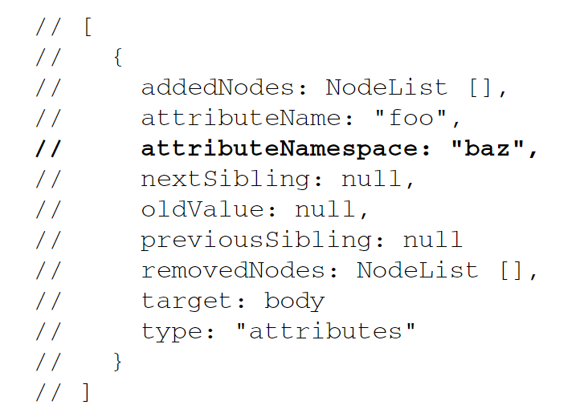

## 第十四章

### 14.3 MutationObserver 接口

#### 14.3.1 基本用法

1. observer(element, MutationObserverInit: object) 方法
   只监听属性的变化:

```js
const observer = new MutationObserver(
  (MutationRecord: [], mutationObserver) => {
    console.log("<body> attributes changed");
  }
);

observer.observe(document.body, { attributes: true });
```

2. 回调 与 MutationRecord
   每次回调都会收到一个 MutationRecord 实例的数组. 回调执行之前可能同时发生多个满足观察条件的事件, 所以每次执行回调都会传入一个包含按顺序入队的 MutationRecord 实例的数组.



传给回调的第二个参数是观察变化的 MutationObserver 的实例.

3. disconnect() 方法
   该方法不仅会停止此后变化事件的回调, 也会抛弃已经加入任务队列要异步执行的回调.

如果想让已经加入任务队列的回调执行, 可以使用 setTimeout() 让已经入列的回调执行完毕再调用 disconnect().

它会停止观察所有目标.

4. 复用 MutationObserver 对象
   一个 MutationObserver 可以观察多个对象, 通过 MutationRecord.target 来判断哪个目标节点发生了变化.

5. 重用 MutationObserver
   调用 disconnect()并不会结束 MutationObserver 的生命。还可以重新使用这个观察者，再将
   它关联到新的目标节点。

#### 14.3.1 MutationObserverInit 与观察范围

观察者可以观察的事件包括属性变化、文本变化和子节点变化。

```js
const observer = new MutationObserver((records) => {
  records.map((x) => x.oldValue);
});

// 属性变化
observer.observe(document.body, {
  attributeFilter: ["class"],
  attrbuteOldValue: true, // 保存属性原来的值
});

// 文本变化
observer.observe(document.body.firstChild, {
  characterData: true,
  characterDataOldValue: true,
});

// 子节点变化
observer.observe(document.body, {
    childList: true,
    childListOldValue: true,
});
```

对子节点重新排序会报告两次变化事件, 一次是删除子节点, 第二次是添加子节点.

- 观察子树
默认情况, MutationObserver 将观察的范围限定为一个元素及其子节点的变化.

可以把观察的范围扩展到这个元素的子树. 需要在 MutationObserverInit 对象中将 subtree 属性设为 true.

有意思的是，被观察子树中的节点被移出子树之后仍然能够触发变化事件。这意味着在子树中的节
点离开该子树后，即使严格来讲该节点已经脱离了原来的子树，但它仍然会触发变化事件。


#### 14.3.3 异步回调与记录队列
MutationObserver 接口是出于性能考虑而设计的，其核心是异步回调与记录队列模型。

为了在大量变化事件发生时不影响性能, 每次变化的信息会保存在 MutationRecord 实例中, 然后添加到**记录队列**.

这个队列对每个 MutationObserver 实例都是唯一的, 是所有 DOM 变化事件的有序列表.

1. 记录队列
每次 MutationRecord 被添加到 MutationObserver 的记录队列时，仅当之前没有已排期的微任
务回调时（队列中微任务长度为0），才会将观察者注册的回调（在初始化 MutationObserver 时传入）
作为微任务调度到任务队列上。这样可以保证记录队列的内容不会被回调处理两次。

不过在回调的微任务异步执行期间，有可能又会发生更多变化事件。因此被调用的回调会接收到一
个 MutationRecord 实例的数组，顺序为它们进入记录队列的顺序。

2. takeRecords()
调用 MutationObserver 实例的 takeRecords() 方法可以清空记录队列, 取出并返回其中的所有 MutationRecord 实例.

```js
const observer = new MutationObserver(mutationRecords => {
    console.log(mutationRecords);
});

observer.observe(document.body, { attributes: true });

document.body.className = 'foo'; 
document.body.className = 'bar'; 
document.body.className = 'baz';

console.log(observer.takeRecords()); 
console.log(observer.takeRecords()); 
 
// [MutationRecord, MutationRecord, MutationRecord] 
// []
```

这在希望断开与观察目标的联系，但又希望处理由于调用disconnect()而被抛弃的记录队列中的
MutationRecord 实例时比较有用。


#### 14.3.4 性能, 内存与垃圾回收
MutationObserver 实例与目标节点之间的引用关系是非对称的。

**MutationObserver 拥有对要观察的目标节点的弱引用。因为是弱引用，所以不会妨碍垃圾回收程序回收目标节点。**

然而，目标节点却拥有对 MutationObserver 的强引用。如果目标节点从 DOM 中被移除，随后
被垃圾回收，则关联的MutationObserver 也会被垃圾回收。

记录队列中的每个 MutationRecord 实例至少包含对已有 DOM 节点的一个引用。如果变化是 childList 类型，则会包含多个节点的引用。

保存这些 MutationRecord 实例，也就会保存它们引用的节点，因而会妨碍这些节点被回收。


## 第十五章 DOM 扩展
#### 15.1.3 matches()
用来检测元素会不会被 querySelector() 或 querySeletorAll() 方法返回。

```js
if (document.body.matches("body.page1")){ 
  // true  
} 
```

### 15.3 HTML5
#### 15.3.1 CSS 类扩展
- classList 属性
想要操作节点的类名, 可以通过 className 属性实现添加, 删除和替换.

className 是一个字符串.

HTML5 给所有元素添加 classList 属性提供操作方法:
- add(value) 添加类名
- contains(value) 返回布尔值
- remove(value)
- toggle(value) 如果类名列表中已经存在指定的value，则删除；如果不存在，则添加。

```js
// 删除"disabled"类 
div.classList.remove("disabled"); 
 
// 添加"current"类 
div.classList.add("current"); 
```


#### 15.3.2 焦点管理
document.activeElement 始终包含当前拥有焦点的 DOM 元素. 页面刚加载完设置为 document.body, 完全加载之前 document.activeElement 的值为 Null

元素.focus() 方法让元素自动获得焦点.

document.hasFocus() 表示文档是否拥有焦点.


#### 15.3.3 HTMLDocument 扩展
1. document.readyState
- loading 文档正在加载
- complete 文档加载完成

2. document.compatMode
- CSS1Compat 标准模式
- BackCompat 混杂模式

当document.compatMode等于CSS1Compat时，浏览器客户区宽度是document.documentElement.clientWidth;
当document.compatMode等于BackCompat时，浏览器客户区宽度是document.body.clientWidth.

浏览器客户区高度、滚动条高度、滚动条的Left、滚动条的Top等等都是上面的情况。


#### 15.3.4 字符集属性
HTML5 增加了几个与文档字符集有关的新属性。其中，characterSet 属性表示文档实际使用的字符集，也可以用来指定新字符集。这个属性的默认值是"UTF-16"，但可以通过<meta>元素或响应头，以及新增的characterSeet 属性来修改。下面是一个例子： 

```js
console.log(document.characterSet); // "UTF-16" 
document.characterSet = "UTF-8"; 
```


#### 15.3.5 自定义数据属性
HTML5 允许给元素指定非标准的属性，但要使用前缀 data-以便告诉浏览器.

定义了自定义数据属性后，可以通过元素的 dataset 属性来访问。

dataset 属性是一个DOMStringMap 的实例，包含一组键/值对映射。元素的每个 data-name 属性在dataset 中都可以通过data-后面的字符串作为键来访问（例如，属性data-myname、data-myName 可以通过myname 访问，但要注意data-my-name、data-My-Name 要通过myName 来访问）。

```js
// 本例中使用的方法仅用于示范 
 
let div = document.getElementById("myDiv"); 
 
// 取得自定义数据属性的值 
let appId = div.dataset.appId; 
let myName = div.dataset.myname; 
 
// 设置自定义数据属性的值 
div.dataset.appId = 23456; 
div.dataset.myname = "Michael"; 
 
// 有"myname"吗？ 
if (div.dataset.myname){  
  console.log(`Hello, ${div.dataset.myname}`); 
}
```

#### 15.3.7 scrollIntoView()
scrollIntoView()方法存在于所有 HTML 元素上，可以滚动浏览器窗口或容器元素以便包含元素进入视口。这个方法的参数如下：

- alignToTop 是一个布尔值。 
    true：窗口滚动后元素的顶部与视口顶部对齐。 
    false：窗口滚动后元素的底部与视口底部对齐。 
- scrollIntoViewOptions 是一个选项对象。 
    behavior：定义过渡动画，可取的值为"smooth"和"auto"，默认为"auto"。 
    block：定义垂直方向的对齐，可取的值为"start"、"center"、"end"和"nearest"，默认为 "start"。 
    inline：定义水平方向的对齐，可取的值为"start"、"center"、"end"和"nearest"，默认为 "nearest"。


