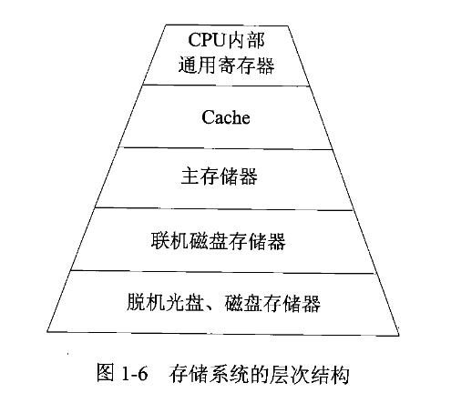
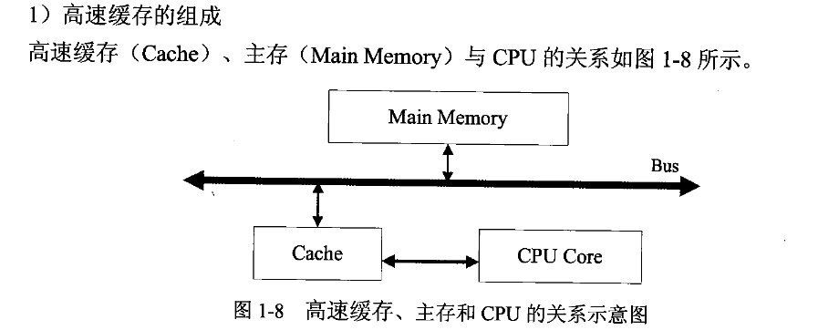
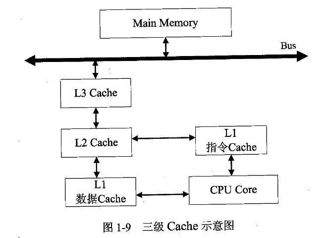

# 软考中级

## 第一章 计算机网络概论

### 1.1 计算机系统基础知识
#### 1.1.3 数据表示

#### 1.1.4 校验码
- 校验码作用：检测传送的数据是否出错.

- 基本思想
将可能出现的编码分成两类: 合法编码和错误编码. 错误编码是不允许在数据中出现的编码.

- 码距
一个编码系统中, 任意两个合法编码之间至少有多少个二进制位不同.

##### 奇偶校验码
在编码中增加一位校验位, 改变编码中 1 的个数的奇偶性, 从而使码距变为2.

奇校验只能检测代码中奇数个位出错的编码, 不能发现偶数个位出错的情况.

常见的奇校验码: 水平奇偶校验码, 垂直奇偶校验码, 水品垂直校验码

##### 海明码
利用奇偶性来纠错和检错的校验方法.

构成方法: 在数据位之间的特定位置插入 k 个校验位, 通过扩大码距来实现.

数据位是 n 位, 校验位是 k 位, 必须满足 2的k - 1 >= n + k.

##### 循环冗余校验码

### 1.2 计算机体系结构

#### 1.2.2 存储系统
1. 存储器的层次结构

2. 存储器的分类
    1) 按照存储器所处的位置分类: 内存, 外存
    

    2) 按存储器的构成材料分类: 磁, 半导体, 光存储器

    3) 按存储器的工作方式分类: 读/写存储器和只读存储器

3. 相联存储器
一种按内容访问的存储器.

工作原理: 数据或者数据的一部分作为关键字, 按照顺序写入信息, 读出时并行地将该关键字与存储器中的每一个单元进行比较, 找出存储器中所有与关键字相同的数据字, 适合于信息的检索与更新.

相联存储器可用在高速缓冲存储器中, 在虚拟存储器中用来作为段表, 页表或快表存储器, 用在数据库和知识库中.

4. 高速缓存 Cache
位于 CPU 和 主存之间; 速度快容量小; 内容时主存局部域的副本, 对程序员来说是透明的.

- 高速缓存中的地址映像方法
CPU 工作时送出的时主存单元的地址, 而应从 Cache 存储器中读/写信息.

需要将主存地址转成 Cache 存储器的地址, 这种地址的转换成为地址映像.

三种映像方法:
- 直接映像
- 全相联映像

